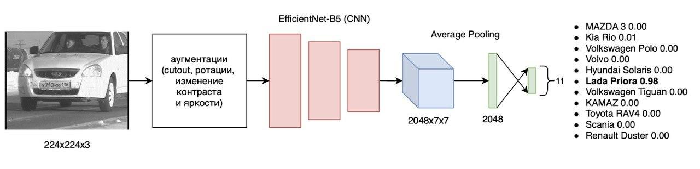

# Server for Car Model, Mark, Category detection and Plate recognition 

## Authors 

[Dmitriy Bochkaryov](https://github.com/mintyque)

[Mark Zakharov](https://github.com/anordertoreclaim)

[Amir Nazyrov](https://github.com/sentenced210)

[Nariman Daniyar](https://github.com/nariman9119)

## Models

### Model for Car Plate Detection 


### Model for Car Plate Recognition 


Attention visualization


### Model for Car Model Classification




## How to run

```
python app.py
```

```
curl --location --request POST 'http://127.0.0.1:5000/uplo
ad' --form 'file=@path/to/image'
```
Output Example
```
{"brand": "LADA", "model": "PRIORA", "probability": 0.9893460320170487, "veh_type": "B", "coord": "[(398,292),(573,360)]", "id": "0001", "plate": "У710КК116"}```